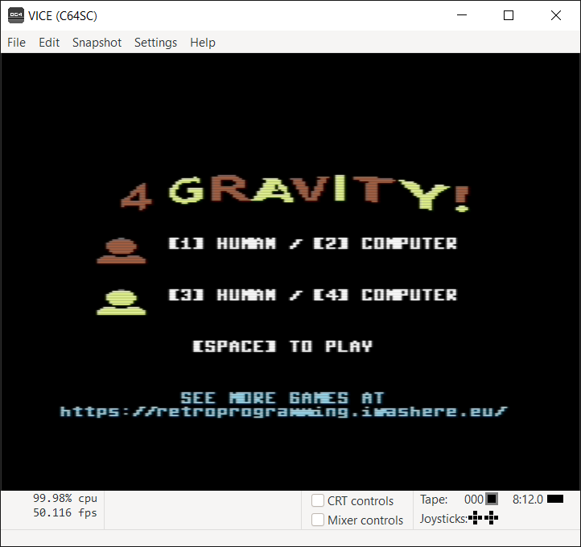
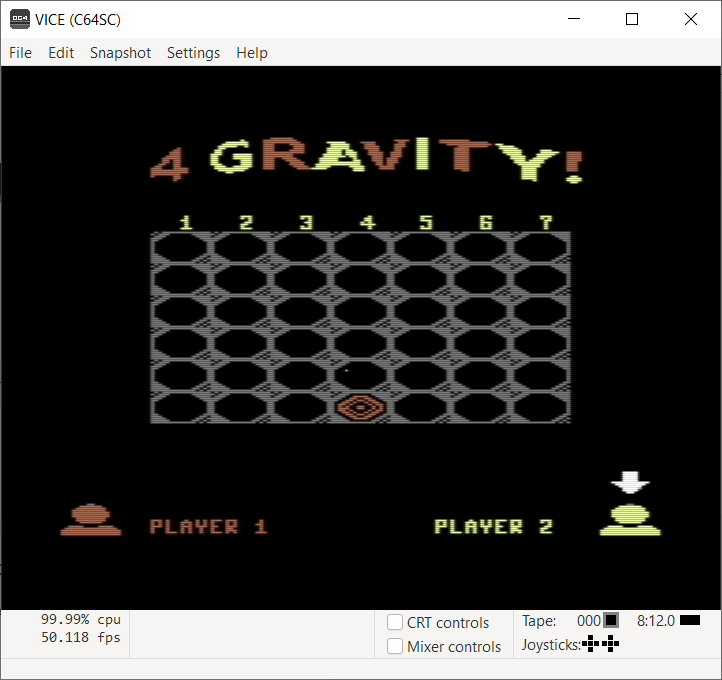

# 4GRAVITY!

A connect 4 clone for retrocomputers

by Marco Spedaletti (asimov@mclink.it)

## ABOUT THIS SOFTWARE

This game is a "Connect Four" clone. It is a two-players, one-player and zero-player connection board game, in which the players take turns dropping colored tokens into a seven-column, six-row vertically suspended grid. The pieces fall straight down, occupying the lowest available space within the column. The objective of the game is to be the first to form a horizontal, vertical, or diagonal line of four of one's own tokens. 

The game participates in the ["Forza 4" Challenge](https://www.facebook.com/groups/retroprogramming/permalink/804753086871615) of the [RetroProgramming Italia - RP Italia](https://www.facebook.com/groups/retroprogramming) group

## CHOOSING PLAYERS

The game allows you to select the type of player for each of the two colors, between computer and human, so there are 4 possible combinations:
  * **2 players mode:** RED (*human*) vs YELLOW (*human*);
  * **1 player mode:** RED (*human*) vs YELLOW (*computer*);
  * **1 player mode:** RED (*computer*) vs YELLOW (*human*);
  * **0 player mode**: RED (*computer*) vs YELLOW (*computer*).

By default the game always starts in **2 players mode**. You can change this setting by pressing the following keys:
  * pressing `1` you choose **RED** player as *human*
  * pressing `2` you choose **RED** player as *computer*
  * pressing `3` you choose **YELLOW** player as *human*
  * pressing `4` you choose **YELLOW** player as *computer*

Finally, pressing `[SPACE]` you will start the game.

## GAMEPLAY

**RED** color will start always as the first, while **YELLOW** color will be always the second. The gameplay example shows the first player starting by dropping one red token into the center column of an empty game board. The arrow always points to who gets the next move.

If the player is *human*, the keyboard will be enabled to wait for a keypress. By pressing a digit from `1` to `7` you will put a token on that particular column. If the column is not full, the token will move up to the lower free limit of the column. If the column is already full, the request will be ignored.

If the player is *computer*, it will choose automatically one of the (free) seven column to put the token on. 

The two players then alternate turns dropping one of their tokens at a time into an unfilled column, until one of them achieves a diagonal four in a row, and wins the game. If the board fills up before either player achieves four in a row, then the game is a draw.

## LANGUAGE

This game has been programmed using **[ugBASIC](https://ugbasic.iwashere.eu)**, a BASIC dialect specialized in programs that are [very efficient "by design"](https://retroprogramming.iwashere.eu/midres_library:isomorphism) on various 8-bit platforms, without the need for "fine tuning" them and without compromises of other dev-kits.

## LICENSE

Copyright 2021 Marco Spedaletti

Licensed under the Apache License, Version 2.0 (the "License");
you may not use this file except in compliance with the License.
You may obtain a copy of the License at

http://www.apache.org/licenses/LICENSE-2.0

Unless required by applicable law or agreed to in writing, software
distributed under the License is distributed on an "AS IS" BASIS,
WITHOUT WARRANTIES OR CONDITIONS OF ANY KIND, either express or implied.
See the License for the specific language governing permissions and
limitations under the License.